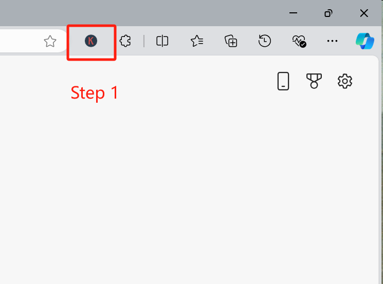
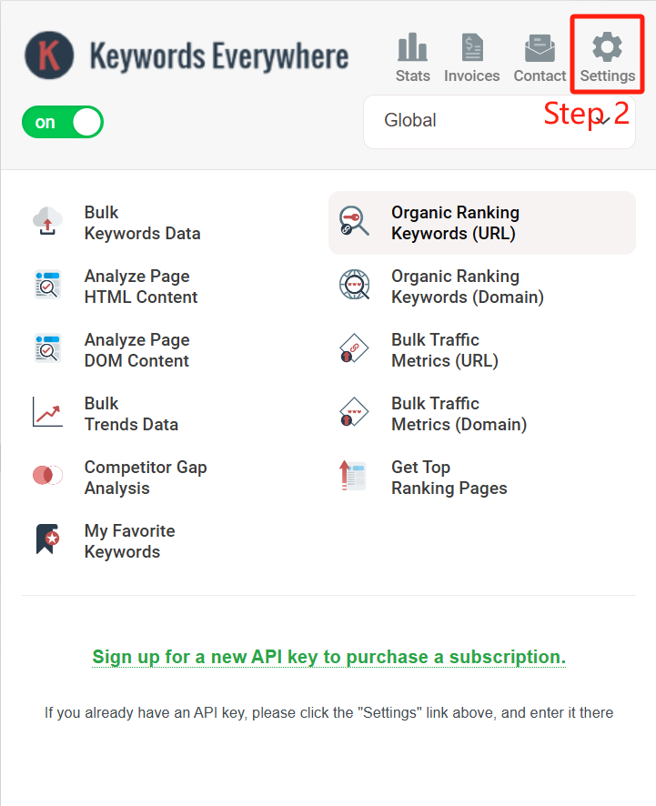
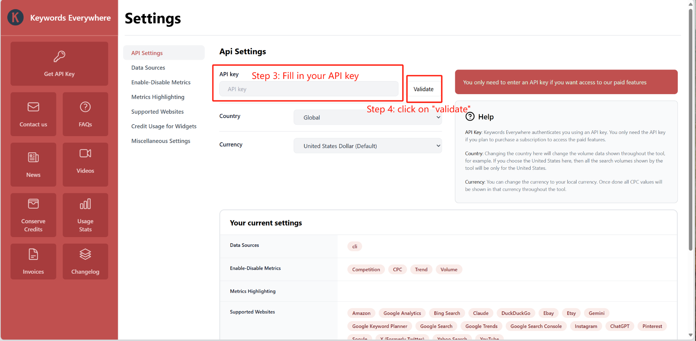
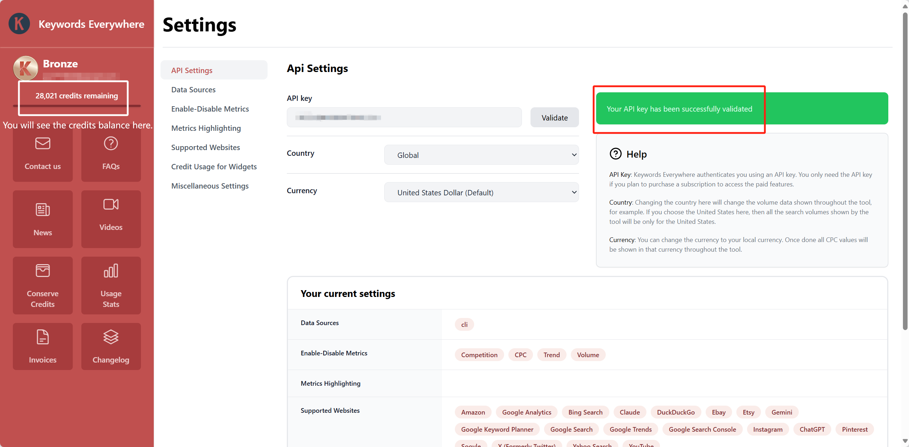
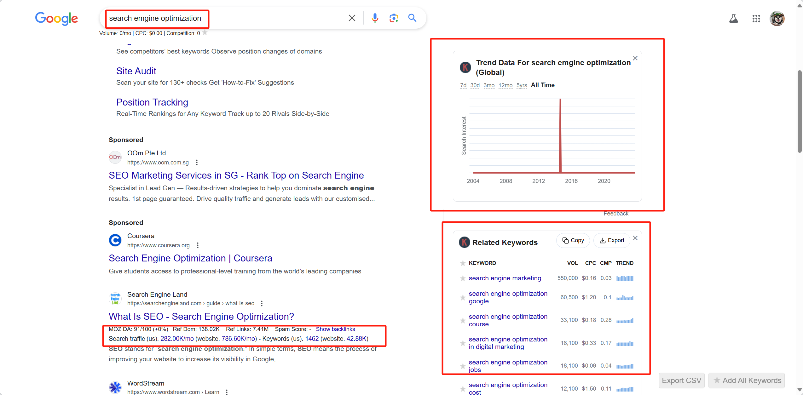

# BT4212

## Instructions for using the Keywords Everywhere tool

### Installation:

* Open the [link](https://keywordseverywhere.com) in your browser (`https://keywordseverywhere.com`). 
    - As listed in the website, `Google Chrome`/`Microsoft Edge`/`Firefox` are suggested for trying the tool.

* Download the extension for your browser. Click on the icon of `Keywords Everywhere`. 

    

* Click on `Setting` button.

    

* Fill in and validate the API key.

    

* If Step 3 is successful, you will see the following message.

    

* You can now use the tool to conduct keyword research.

### Usage Example:

* Go to the Google search engine and type in a keyword. You will see the information such as search volume and CPC of the keyword.

    

